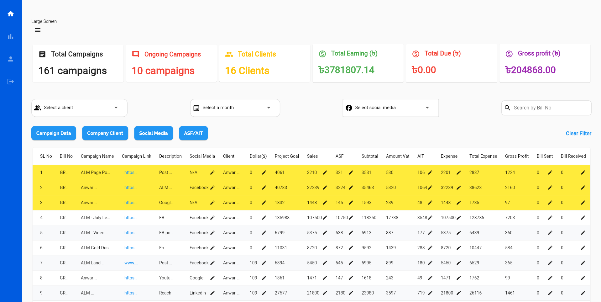
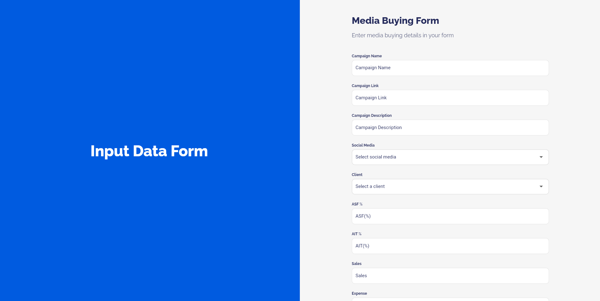

# Greenovent-Digital-Portal
Greenovent Digital Portal is a powerful tool designed to streamline media buying data management and enhance digital marketing campaign monitoring for the Digital Agency, Greenovent. This portal simplifies the process of inputting, tracking, and analyzing media buying data while offering various features to improve efficiency and accuracy

<h1>Overview</h1>
In the fast-paced world of digital marketing and media buying, having a centralized and efficient platform for data management is crucial. The Greenovent Media Monitoring Portal serves as a hub where internal users can easily input and manage data related to media buying campaigns. This portal offers a wide range of features to simplify data entry, tracking, and analysis.

<h2>Features</h2>
<h3>1. Streamlined Data Entry</h3>
Input essential campaign data, including Sales Data, Project Goal, ASF, Subtotal, Amount Vat, AIT, Expense, Total Expense, and Gross Profit.

<h3>2. Dynamic Row Color Coding</h3>
Automatically change the row color based on the bill status of each campaign, providing quick visual cues for campaign status.

<h3>3. User Activity Tracking</h3>
Track the user who last edited a row and send email notifications to the head of the company for enhanced accountability.

<h3>4. Financial Calculations</h3>
Calculate total earnings, dues, and gross profits based on selected months and clients, providing valuable insights into campaign performance.

<h3>5. Flexible Filtering</h3>
Utilize four filter options, which can be combined for precise data filtering or used individually for broader searches.

<h3>6. Additional Features</h3>
Explore various minor features designed to improve the overall user experience and data management efficiency.

<h2>Technology Stack 💻</h2> 
<h3>Frontend & Mobile</h3>
Developed using Flutter with Dart, offering a responsive, cross-platform experience.

<h3>Database 🗄️</h3>
Relies on Firebase Realtime Firestore and Database for data storage, ensuring instantaneous synchronization and scalability.

<h2>App Screenshots</h2>

